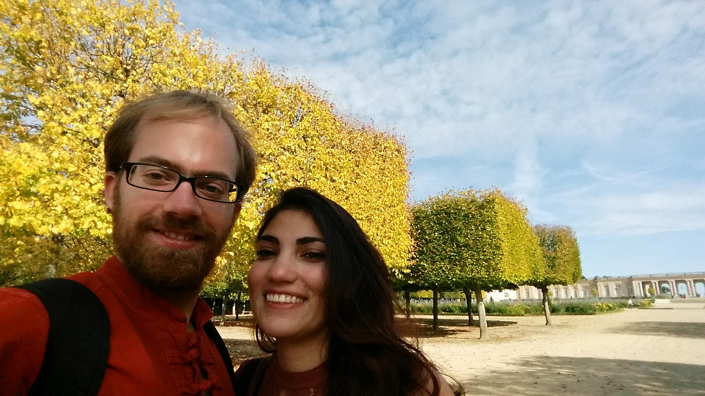

## We are searching

We are Parisa and Abel, a couple, and we are searching for a voluntary project where we can contribute to people communities or people in need. 

A voluntary project around 2-3 month is what we are thinking about. We would like to teach, or work with children. If some other activities would be more useful, we are happy to do something else too, yet we would like to work with people. 

### Our Skills

As both of us are completely inexperienced in volunteering, we are not sure what useful skills we can bring to a voluntary project. Nevertheless we tried to list what we think could be useful.

#### Parisa

- Speaks English / Farsi and somewhat Dutch, Arabic and German.
- PhD in physics / material sciences
- Teaching mathematics, natural sciences or english —  I was tutoring students during high school and my PhD
- Driving License, B2.

#### Abel

- Speaks English / German / Hungarian and somewhat Dutch.
- PhD in biology / bioinformatics
- Knowledge in natural sciences and programming. 
- Some practical skills and skills to handle unexpected situations learnt by [traveling to many places](https://www.couchsurfing.com/people/vertesy.abel).
- Decent navigation thanks to years of [orienteering](https://en.wikipedia.org/wiki/Orienteering).
- Driving License, B2.

### Aim 

We would like to help people or communities using our skills, as well as to learn about the life and needs of people in less developed parts of the world.

We would like to find a projects where we can be most useful, preferentially teaching children. Parisa would be also happy to work on empowering women too.

### Timing

A 2-3 months period within a ~7 month interval between May/2018 and Nov/2018.

### Location

We are pretty open about the region. If we can communicate with locals in some of our languages, that would be a plus.

## Contact us!

If you have a good idea for us, or willing to share your experience, please write us on ***vertesy _AT hubrecht _dot eu***

